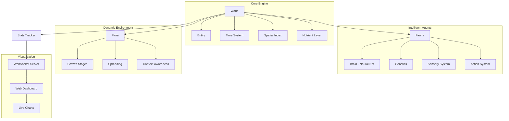

<div align="center">

# 🌌 Project-AURA

### *Agents United in Responsive Atmospheres*

**An AI multi-agent ecosystem simulation where intelligent Fauna and dynamic Flora co-evolve to produce emergent behaviors.**

[](https://python.org)
[](LICENSE)
[]()

---

*Watch evolution happen in real-time as neural-net driven creatures hunt, forage, flee, and reproduce in a living world with seasons, storms, and nutrient cycles.*

</div>

---

## 🧬 What is AURA?

AURA is a self-contained artificial life simulation that demonstrates **emergent intelligence** through simple rules. Instead of scripting behaviors, each creature has a tiny **neural network brain** that evolves over generations through genetic inheritance and mutation.

### Key Features

- 🐇 **Intelligent Fauna** — Herbivores, Predators, and Omnivores with neural-net-driven decision making
- 🌿 **Dynamic Flora** — Context-aware plant life that grows, spreads, and responds to seasons & soil nutrients
- 🧠 **Evolving Brains** — Each agent has a feed-forward neural network (8→12→6) that evolves via crossover + mutation
- 🧬 **Genetic System** — Speed, vision, size, and metabolism are inherited with variation
- 🌦️ **Environmental Events** — Rain, droughts, and storms affect the ecosystem dynamically
- 📊 **Live Dashboard** — Real-time web visualization with population charts, trait tracking, and world rendering
- 🔄 **Day/Night & Seasons** — Full temporal cycle (Dawn→Day→Dusk→Night) and (Spring→Summer→Autumn→Winter)
- 📈 **Biodiversity Tracking** — Shannon diversity index and emergent behavior detection

---

## 🏗️ Architecture



---

## 🚀 Quick Start

### Installation

```bash
# Clone the repo
git clone https://github.com/raghu-007/Project-AURA.git
cd Project-AURA

# Install dependencies
pip install -r requirements.txt
```

### Run the Simulation

```bash
# With live web dashboard
python -m aura

# Open your browser at http://localhost:8765
```

```bash
# Headless mode (no visualization)
python -m aura --headless

# Custom configuration
python -m aura --config configs/default.yaml --width 100 --height 80

# Max speed for benchmarking
python -m aura --speed 0 --ticks 1000 --headless
```

### CLI Options

| Flag | Description | Default |
|------|-------------|---------|
| `--config, -c` | Path to YAML config file | `configs/default.yaml` |
| `--width, -W` | World grid width | 80 |
| `--height, -H` | World grid height | 60 |
| `--headless` | Run without web dashboard | `false` |
| `--port, -p` | WebSocket server port | 8765 |
| `--speed, -s` | Seconds between ticks (0=max) | 0.1 |
| `--ticks, -t` | Max ticks to run (0=infinite) | 0 |

---

## 🧠 How the AI Works

Each Fauna agent has a lightweight **feed-forward neural network**:

```
Inputs (8)          Hidden (12, tanh)          Actions (6, softmax)
┌──────────┐        ┌──────────┐               ┌──────────┐
│ hunger   │───┐    │          │          ┌────►│ wander   │
│ energy   │───┤    │          │          │    │ forage   │
│ fear     │───┤    │  12 neurons ├───────┤    │ flee     │
│ food_dist│───┼───►│  (tanh)  │          │    │ chase    │
│ pred_dist│───┤    │          │          ├────►│ reproduce│
│ mate_dist│───┤    │          │          │    │ rest     │
│ time     │───┤    │          │          │    └──────────┘
│ crowding │───┘    └──────────┘          │
└──────────┘                              │
                                   Probabilistic
                                   selection
```

**Evolution**: When two agents reproduce, their brain weights are **crossed over** and **mutated**, creating offspring with slightly different behavior. Over generations, agents that survive and reproduce more pass on their neural patterns — **natural selection in action**.

---

## 🌿 Ecosystem Mechanics

### Food Chain
```
☀️ Sunlight + 🌊 Soil Nutrients
        ↓
    🌿 Flora (Grass → Bush → Tree)
        ↓
    🐇 Herbivores  ←──── 🦊 Omnivores
        ↓                    ↓
    🐺 Predators ────────────┘
        ↓
    💀 Death → Nutrients return to soil
```

### Seasons
| Season | Flora Growth | Activity |
|--------|-------------|----------|
| 🌸 Spring | 1.5× boost | High |
| ☀️ Summer | Normal | Normal |
| 🍂 Autumn | 0.6× reduced | Moderate |
| ❄️ Winter | 0.2× minimal | Low |

### Environmental Events
| Event | Effect | Duration |
|-------|--------|----------|
| 🌧️ Rain | Flora growth ×2 | 30 ticks |
| 🏜️ Drought | Flora growth ×0.3 | 50 ticks |
| ⛈️ Storm | Random fauna damage | 10 ticks |

---

## 📁 Project Structure

```
Project-AURA/
├── aura/                   # Core Python package
│   ├── __init__.py         # Package metadata
│   ├── __main__.py         # CLI entry point
│   ├── brain.py            # Neural decision engine
│   ├── config.py           # YAML config loader
│   ├── ecosystem.py        # Population seeding & food chain
│   ├── entity.py           # Base Entity class
│   ├── fauna.py            # Intelligent agent (Fauna)
│   ├── flora.py            # Dynamic plants (Flora)
│   ├── server.py           # WebSocket server
│   ├── stats.py            # Statistics & biodiversity tracker
│   └── world.py            # World simulation engine
├── viz/                    # Web-based live dashboard
│   ├── index.html          # Dashboard layout
│   ├── style.css           # Dark sci-fi styles
│   └── app.js              # WebSocket + Canvas renderer
├── configs/
│   └── default.yaml        # Default simulation parameters
├── tests/                  # Unit tests
│   ├── test_brain.py
│   ├── test_ecosystem.py
│   ├── test_fauna.py
│   ├── test_flora.py
│   └── test_world.py
├── requirements.txt
├── setup.py
├── LICENSE                 # MIT License
└── README.md
```

---

## ⚙️ Configuration

All parameters are tunable via `configs/default.yaml`:

```yaml
world:
  width: 80
  height: 60
  tick_speed: 0.1
  day_length: 100
  season_length: 500

fauna:
  initial_herbivores: 30
  initial_predators: 8
  initial_omnivores: 5
  vision_radius: 6
  mutation_rate: 0.1

flora:
  initial_grass: 200
  initial_bushes: 60
  initial_trees: 20
  spread_probability: 0.02
```

---

## 🧪 Running Tests

```bash
pip install pytest
python -m pytest tests/ -v
```

---

## 🔮 Emergent Behaviors to Observe

After running the simulation for 200+ ticks, you may notice:

- **Herding** — Herbivores clustering near dense vegetation
- **Population Oscillations** — Classic predator-prey Lotka-Volterra cycles
- **Trait Drift** — Average speed/vision shifting as selection pressure changes
- **Territorial Patterns** — Predators staking out high-traffic areas
- **Seasonal Migration** — Fauna concentrating where flora is richest

---

## 🤝 Contributing

Contributions are welcome! Feel free to:

1. Fork the repository
2. Create a feature branch (`git checkout -b feature/amazing-feature`)
3. Commit your changes (`git commit -m 'Add amazing feature'`)
4. Push to the branch (`git push origin feature/amazing-feature`)
5. Open a Pull Request

---

## 📜 License

This project is licensed under the **MIT License** — see [LICENSE](LICENSE) for details.

---

<div align="center">

*Built with 🧬 by [Raghu S](https://github.com/raghu-007)*

**⭐ Star this repo if you find it interesting!**

</div>
